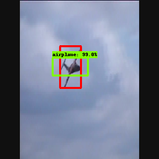

# Tensorflow implementation for lstm object detection

## Description

This is nearly official implementation for the paper **[Looking Fast and Slow: Memory-Guided Mobile Video Object Detection]**[link](https://arxiv.org/pdf/1903.10172v1.pdf).
Mason Liu, Menglong Zhu, Marie White, Yinxiao Li, Dmitry Kalenichenko. (CVPR 2019)

## Explanation

What are the differences between this repo and the official one at https://github.com/tensorflow/models/tree/master/research/lstm_object_detection ?

- In the official implementation, tfrecords creation and label map are missing, so we added script for creating tfrecords from Imagenet VID 2015, as well as label map for 30 classes
- In `evaluator.py` script, we change dictionary syntax from python 2.x to 3.x
- In `lstm_ssd_interleaved_mobilenet_v2_imagenet.config`, we temporarily disable data augmentation, since it throws error, which cant be fixed yet. Additionally, we also add `input_path` and `label_map_path` for training and evaluation data, for being compatible with our docker's setting
- All other parts are kept the same with official implementation

## Prepare tfrecords

First, make sure that you are using tensorflow 1.x (We tested with tensorflow 1.15). 

Run `python tf_record_creation_look_fast_and_slow.py --root_dir path/to/ILSVRC2015 --output_path path/to/output/folder --set [train|val]`

For example, on gpu1, I run: 

- `python tf_record_creation_look_fast_and_slow.py --root_dir /mnt/datasets/imagenet/ILSVRC2015 --output_path ./VID_tfrecords --set train`
- `python tf_record_creation_look_fast_and_slow.py --root_dir /mnt/datasets/imagenet/ILSVRC2015 --output_path ./VID_tfrecords --set val`

Additionally, for testing purpose, we also provide script for creating tfrecords for a single class (airplane). You could use script `tf_record_creation_look_fast_and_slow_one_class.py` instead of `tf_record_creation_look_fast_and_slow.py` and follow the instruction above, plus change `num_classes` from 30 to 1 in config file

## Steps

Assume that:

- Docker image's name is **tf**.
- The absolute path to created tfrecords is `/path/to/VID_tfrecords`.
- The absolute path to this cloned repository is `/path/to/models`.
- You only want to use the first available gpu

Build:

`docker build -t tf .`

Run:

`docker run --runtime=nvidia -it --rm --volume=/path/to/VID_tfrecords:/VID_tfrecords --volume=/path/to/models:/tensorflow/models --gpus device=0 tf`

Train:

`python ./models/research/lstm_object_detection/train.py --logtostderr --train_dir=output --pipeline_config_path=./models/research/lstm_object_detection/configs/lstm_ssd_interleaved_mobilenet_v2_imagenet.config`

Loss visualization:

Loss will be recorded at ./output. For visualizing loss, you could simply run:

`tensorboard --logdir ./output`

There is one sample output directory on gpu1, located at `/home/vn/training/output`

Below is tensorboard for total loss after we trained a model for 2 days

   
  <i>Total loss</i>

Evaluate:

`python ./models/research//lstm_object_detection/eval.py --logtostderr --eval_dir=output_prediction --pipeline_config_path=./models/research/lstm_object_detection/configs/lstm_ssd_interleaved_mobilenet_v2_imagenet.config --checkpoint_dir=./output`

Prediction visualization:

`tensorboard --logdir ./output_prediction`

Below are 2 examples for prediction from our network. Frame order is from left to right, top to bottom, 8 random consecutive frames for 2 test video are evaluated:

* Test video 1:

   

   

* Test video 2:

   

   

## Config
We disable image augmentation in config file, since enabling it throws error, which cant be solved yet. All other part we keep intact

## TODO
- [x] Tfrecords creation
- [x] Adjust scripts (if necessary)
- [x] Run training + loss visualization
- [ ] Is result from paper reproduced ?

## Known issues
At the moment, the performance is not as good as what described in the paper. Additionally, we realize that predicted bounding boxes tend to have similar shapes, regardless of actual shape of ground-truth. The next step will be training backbone to have better lstm weight initialization
